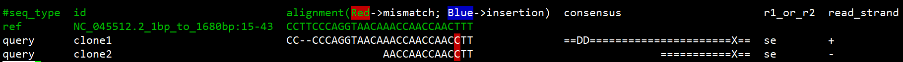

# bam2msa
convert alignment bam file to multiple sequence alignment(msa) file(need samtools)

```
$ cd test/

$ ../src/bam2msa ref.fa out.bwa.bam NC_045512.2_1bp_to_1680bp:15-43|cut -f 1-6|column -ts $'\t'|less -RS
1                              2                              3                              4                                5         6
#query_msa                     ref_msa                        consensus_msa                  ref_cut_region                   query_id  r1_or_r2
CC--CCCAGGTAACAAACCAACCAACCTT  CCTTCCCAGGTAACAAACCAACCAACTTT  ==DD======================X==  NC_045512.2_1bp_to_1680bp:15-43  clone1    se
               AACCAACCAACCTT  CCTTCCCAGGTAACAAACCAACCAACTTT                 ===========X==  NC_045512.2_1bp_to_1680bp:15-43  clone2    se


## add --output-format 2
$ ../src/bam2msa ref.fa out.bwa.bam NC_045512.2_1bp_to_1680bp:15-43 --output-format 2|cut -f 1-7|column -ts $'\t'|less -RS
1          2                                3                              4                              5         6
#seq_type  id                               alignment                      consensus                      r1_or_r2  read_strand
ref        NC_045512.2_1bp_to_1680bp:15-43  CCTTCCCAGGTAACAAACCAACCAACTTT                                  
query      clone1                           CC--CCCAGGTAACAAACCAACCAACCTT  ==DD======================X==  se        +
query      clone2                                          AACCAACCAACCTT                 ===========X==  se        -
```

```
## colorsize snp/indel of output with --colorize-snp-indel 1 
$ ../src/bam2msa ref.fa out.bwa.bam NC_045512.2_1bp_to_1680bp:15-43 --colorize-snp-indel 1 --output-format 2|cut -f 1-7|column -ts $'\t'|less -RS
```



```
$ ../src/bam2msa
Contact: ilikeorangeapple@gmail.com or go to https://github.com/orangeSi/bam2msa/issues
Usage:
  bam2msa [flags...] <ref> <bam> <regions> [arg...]

convert bam to msa format for alignment file

Flags:
  --colorize-snp-indel (default: 0)           # colorize snp and indel of output
  --display-read-boundary (default: 1)        # display the read boundary, 0 mean not display
  --help                                      # Displays help for the current command.
  --measure-run-time (default: 0)             # measure the run time of code
  --primary-only (default: 1)                 # only for primary alignment. 0 mean all alingment, 1 is only primary alignment
  --span-whole-region-read-only (default: 0)  # only for read which span the whole region. 0 mean all read which overlap with the region, 1 mean is read which span the whole region
  --version                                   # Displays the version of the current application.

Arguments:
  ref (required)                              # ref fasta file
  bam (required)                              # bam alignemnt file or STDIN 
  regions (required)                          # display read and ref msa alignment in these regions, example: chr1:1000-1200,chr2:2000-2300

```

```
$ cd test && cat demo.sh 
set -e
./bam2msa ref.fa out.bwa.bam NC_045512.2_1bp_to_1680bp:1-1680 --span-whole-region-read-only 0 >out.bam2msa
cat out.bam2msa |grep -v '^#'|awk -F '\t' '{print ">"$4"\n"$2"\n>"$5"\n"$1}'|sed 's/:.*//' >out.bam2msa.msa

ln -sf  out.bam2msa.msa case
ln -sf  ../data/out.mafft.msa control
diff control case
if [ $? -eq 0 ];
then
	echo "ok, test passed!"
else
	echo "sorry, test failed! give a issue to me please~~~"
fi

$ sh demo.sh
ok, test passed!

```
## for wasm  support
```
samtools view data/out.bwa.bam|wasmer  --dir=data/ src/bam2msa_final.wasm -- data/ref.fa STDIN NC_045512.2_1bp_to_1680bp:1-1680 
```
